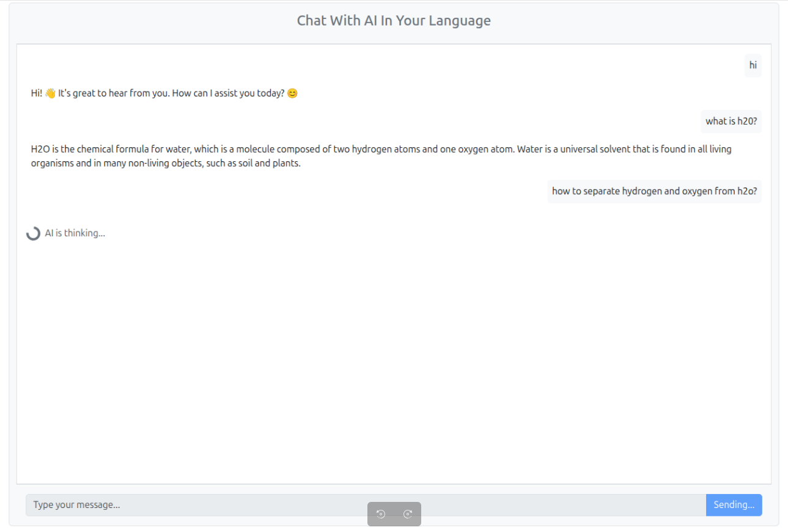
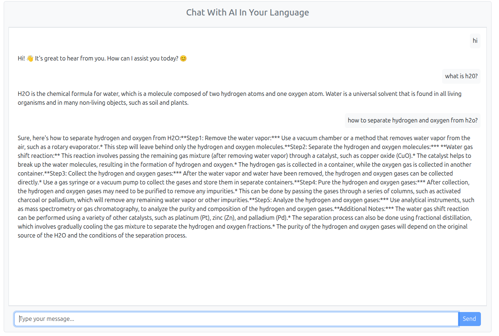

# AI MultiLang Chat
Conversational AI with Multi-Language Support  
Built with Java (Spring Boot), Angular, Bootstrap, and LLMs (OpenAI & Local)

### App Screens

## 🌟 Overview
This is an AI-powered chat application that:
1. Responds to user queries via **text** or **speech**.
2. Supports **multiple languages** (auto-detect or user-selected). 
3. Uses **LLM** (local or OpenAI) selected via **Strategy Pattern**. 
4. Showcases clean **frontend UI** built with **Angular + Bootstrap**.
5. TODO: Add support for Speech to text search

## 🛠 Tech Stack
1. **Java 21** + **Spring Boot 3**
2. **OpenAI API** And **Local LLM** (switchable)
3. **Angular** + HTML + Bootstrap CSS
4. **Ollama gemma:2b**
5. **Docker**

## 🚀 Features
1. Real-time text chat.
2. Multilingual support (translate & respond in any language).
3. Switch between **local LLM** and **OpenAI**.

## 💡 Why this Project?
#### Demonstrates
1. AI integration with system design.
2. Multi-language capabilities.
3. Clean architecture using **SOLID** & **Design Patterns**.

## Setup
### Instructions
1. Download "gemma:2b" LLM locally
2. Angular + Java + Ollama gemma:2b will be run inside Docker. Just run docker compose
3. Open http://localhost:4200
4. AI Chat response will depend on how good system handles LLM model.

### Setup Ollama
**Choose any according to the need**
1. **gemma:2b** | ~2.5 GB | Lightest, fast, great for dev/test	ollama pull gemma:2b
2. **mistral**  | ~4.1 GB | More capable, still fast	ollama pull mistral
3. **llama2**	| ~3.8 GB | Slower, heavier than gemma/mistral	ollama pull llama2
4. **llama3**	| ~4.7 GB | Most capable, but slower	ollama pull llama3

##### Using for this project
    curl -fsSL https://ollama.com/install.sh | sh
    ollama --version
    ollama pull gemma:2b

### Docker
    sudo docker-compose up --build -d
    sudo docker-compose down

